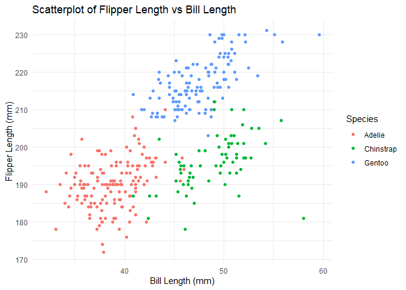

p8105_hw1_yh683
================
Yining He
2024-09-15

Before the Problem I have install.packages(“palmerpenguins”)in the
conclose directly.

# Problem 1

    ## ── Attaching core tidyverse packages ──────────────────────── tidyverse 2.0.0 ──
    ## ✔ dplyr     1.1.4     ✔ readr     2.1.5
    ## ✔ forcats   1.0.0     ✔ stringr   1.5.1
    ## ✔ ggplot2   3.5.1     ✔ tibble    3.2.1
    ## ✔ lubridate 1.9.3     ✔ tidyr     1.3.1
    ## ✔ purrr     1.0.2     
    ## ── Conflicts ────────────────────────────────────────── tidyverse_conflicts() ──
    ## ✖ dplyr::filter() masks stats::filter()
    ## ✖ dplyr::lag()    masks stats::lag()
    ## ℹ Use the conflicted package (<http://conflicted.r-lib.org/>) to force all conflicts to become errors

    ##       species          island    bill_length_mm  bill_depth_mm  
    ##  Adelie   :152   Biscoe   :168   Min.   :32.10   Min.   :13.10  
    ##  Chinstrap: 68   Dream    :124   1st Qu.:39.23   1st Qu.:15.60  
    ##  Gentoo   :124   Torgersen: 52   Median :44.45   Median :17.30  
    ##                                  Mean   :43.92   Mean   :17.15  
    ##                                  3rd Qu.:48.50   3rd Qu.:18.70  
    ##                                  Max.   :59.60   Max.   :21.50  
    ##                                  NA's   :2       NA's   :2      
    ##  flipper_length_mm  body_mass_g       sex           year     
    ##  Min.   :172.0     Min.   :2700   female:165   Min.   :2007  
    ##  1st Qu.:190.0     1st Qu.:3550   male  :168   1st Qu.:2007  
    ##  Median :197.0     Median :4050   NA's  : 11   Median :2008  
    ##  Mean   :200.9     Mean   :4202                Mean   :2008  
    ##  3rd Qu.:213.0     3rd Qu.:4750                3rd Qu.:2009  
    ##  Max.   :231.0     Max.   :6300                Max.   :2009  
    ##  NA's   :2         NA's   :2

## 1.Short description of the penguins dataset

### Important variables

**(1)Species:Adelie(152), Chinstrap(68), Gentoo(124)**

**(2)island:Biscoe(168), Dream(124), Torgersen(52)**

**(3)bill_length_mm:The length of the penguin’s bill in millimeters.**

**(4)bill_depth_mm:The depth of the penguin’s bill in millimeters.**

**(5)flipper_length_mm:The length of the penguin’s flipper in
millimeters.**

**(6)body_mass_g:The body mass of the penguin in grams.**

**(7)sex： Female(165), Male(168)**

**(8)year:The year in which the penguin was observed(2007-2009)**

### The size of the dataset

``` r
# rows of dataset
nrow(penguins)
```

    ## [1] 344

``` r
# columns of dataset
ncol(penguins)
```

    ## [1] 8

**The rows of this dataset is 344 and the columns of this dataset is
8.**

### The mean of flipper length

    ## [1] 200.9152

**The mean of flipper_length is 200.9152 mm.**

## 2.Make a scatterplot of flipper_length_mm (y) vs bill_length_mm (x)

input data and pakages

Create the scatterplot

``` r
ggplot(penguins, aes(x = bill_length_mm, y = flipper_length_mm, color = species)) + 
  geom_point() +
  labs(title = "Scatterplot of Flipper Length vs Bill Length",
       x = "Bill Length (mm)",
       y = "Flipper Length (mm)",
       color = "Species") +
  theme_minimal()
```

    ## Warning: Removed 2 rows containing missing values or values outside the scale range
    ## (`geom_point()`).

<!-- --> Export
the first ggplot.

    ## Saving 7 x 5 in image

    ## Warning: Removed 2 rows containing missing values or values outside the scale range
    ## (`geom_point()`).

# Problem 2

## Create the Data Frame

    ## # A tibble: 10 × 4
    ##    vec_char vec_numeric vec_logical vec_factor
    ##    <chr>          <dbl> <lgl>       <fct>     
    ##  1 A            -2.17   FALSE       LEVEL1    
    ##  2 B            -0.0833 FALSE       LEVEL2    
    ##  3 C            -0.645  FALSE       LEVEL3    
    ##  4 D            -0.796  FALSE       LEVEL1    
    ##  5 E            -1.03   FALSE       LEVEL2    
    ##  6 F             1.39   TRUE        LEVEL3    
    ##  7 G            -0.282  FALSE       LEVEL1    
    ##  8 H             1.28   TRUE        LEVEL2    
    ##  9 I             0.172  TRUE        LEVEL3    
    ## 10 J            -0.381  FALSE       LEVEL1

## Taking the Mean of Each Variable

mean_sample \<- mean(df %\>% pull(sample_data))  
mean_logical \<- mean(df %\>% pull(logical_vector))  
mean_character \<- mean(df %\>% pull(character_vector))  
mean_factor \<- mean(df %\>% pull(factor_vector))

**sample_data**: This works because it is numeric. mean() can compute
the mean of numeric vectors.

**logical_vector**: This works because logical values in R are coerced
to numeric when using mean(), where TRUE becomes 1 and FALSE becomes 0.

**character_vector**: This fails because characters cannot be coerced to
numeric directly. mean() doesn’t know how to handle non-numeric values.

**factor_vector**: This fails because factors are internally stored as
integers, but mean() does not automatically convert these integers in a
meaningful way.

## Applying as.numeric() to Each Variable

``` r
print(as.numeric(example_df[["vec_char"]]))
print(as.numeric(example_df[["vec_logical"]]))
print(as.numeric(example_df[["vec_factor"]]))
```

The outputs occur because as.numeric() shows differently for each
variable type: it returns NA for character vectors since they can’t be
directly converted to numbers; it converts logical vectors to 0 (for
FALSE) and 1 (for TRUE); and it converts factor vectors to their
internal numeric codes representing the factor levels (e.g., “Level1” =
1, “Level2” = 2).
